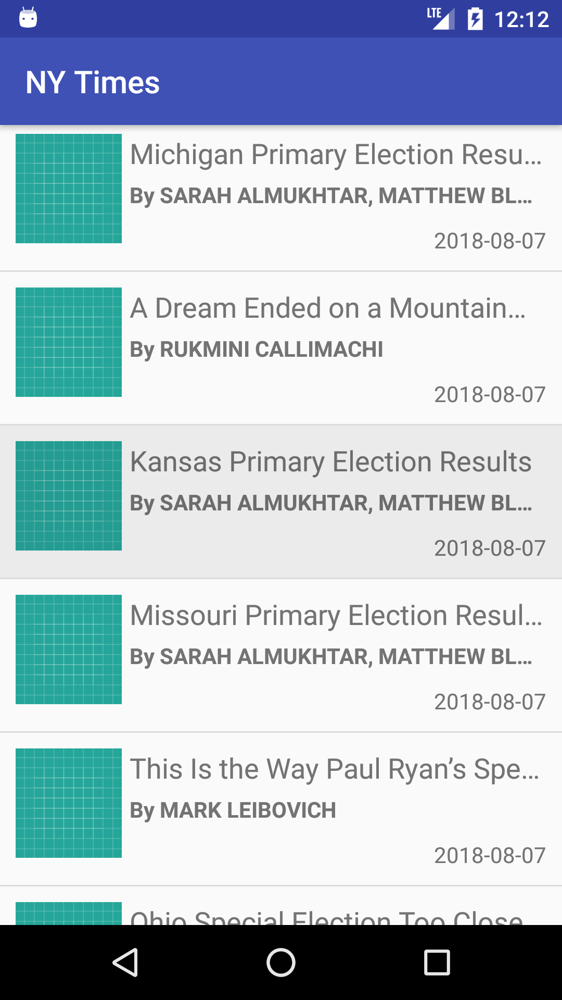

# NYTimes
A simple android app to hit the NY Times Most Popular Articles API and show a list of articles, that shows details when items on the list are tapped (a typical master/detail app).

## Developed
1. Model–view–viewmodel (MVVM) architectural pattern
2. Offline supported
3. Retrofit server call 
4. UI & functions tested using JUnit & espress
5. NDK/C++ secure api key and urls

## Screens

<b>Main article list Screen</b>

<b>Details View Screen</b>

